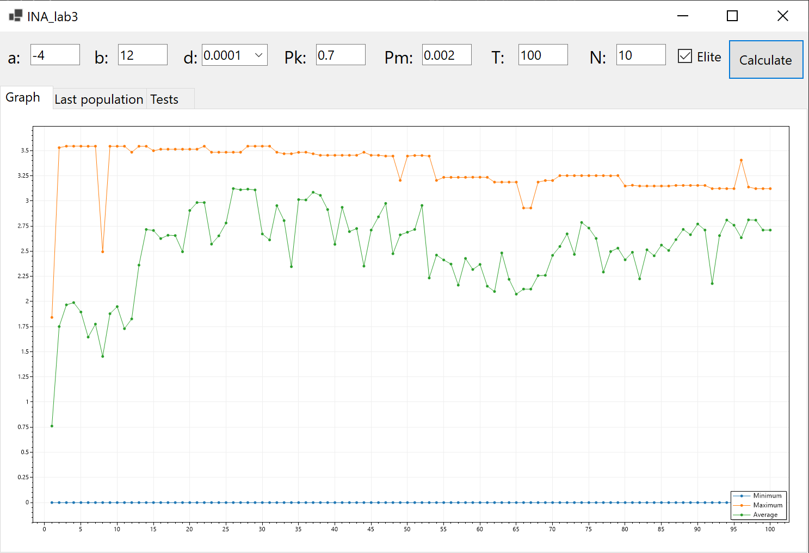
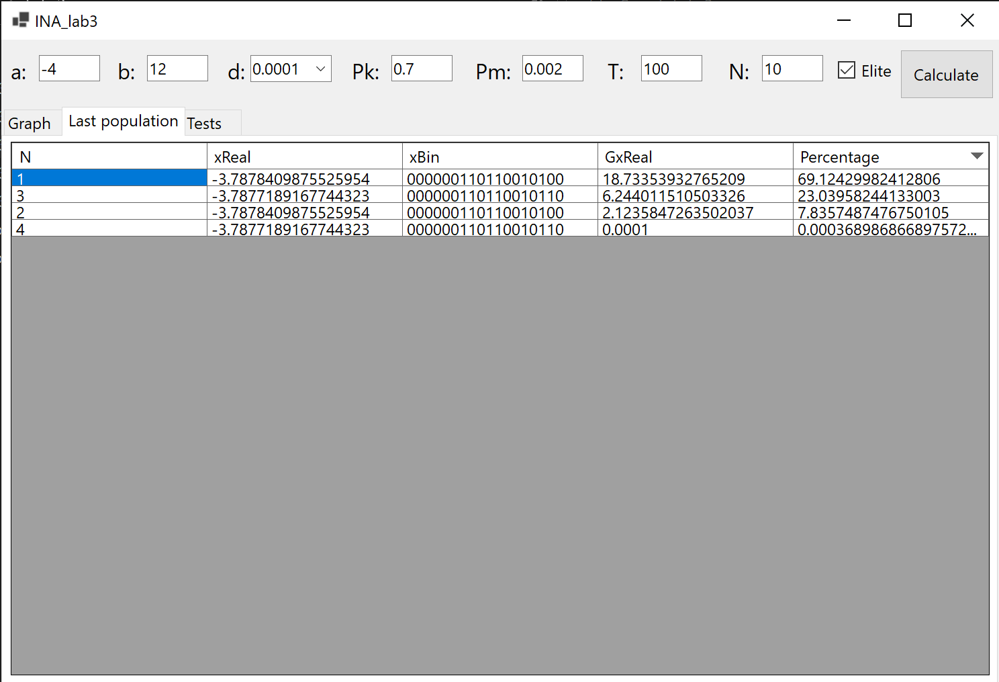
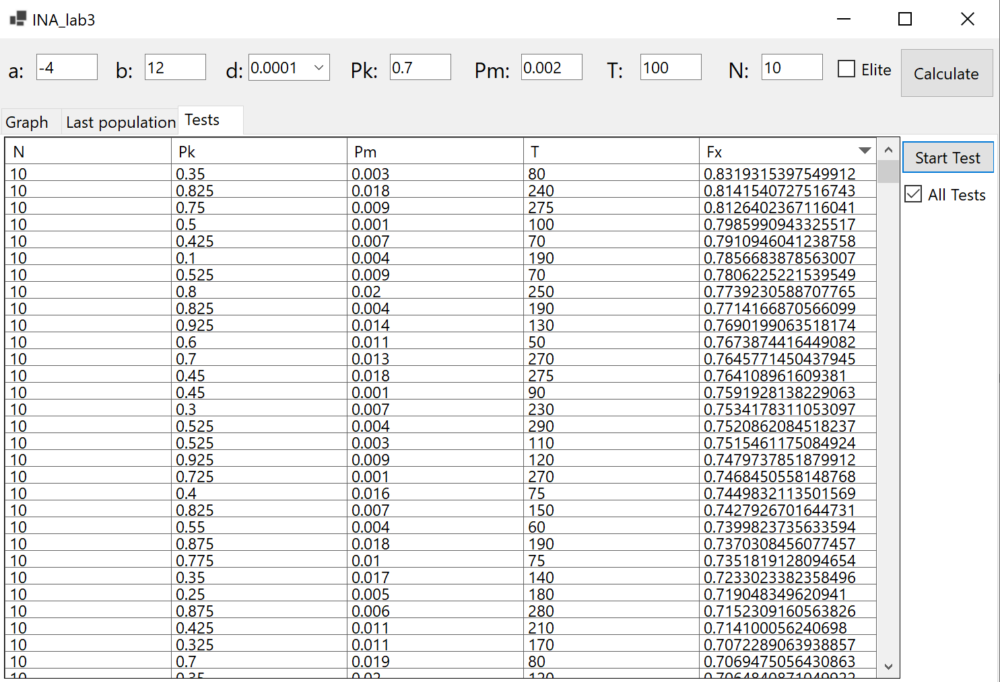

# Algorytm genetyczny

### This is a desktop application that is an implementation of a genetic algorithm aimed at finding the maximum value of a given function in a given range of numbers.

## Key features and characteristics of the project:

### 1. Encoding Individuals:
Individuals are represented as binary sequences, depicting variable values in a genetic code.

### 2. Random Initialization of the Population: 
The initial population is created, taking into account parameters such as population size and variable range.

### 3. Evaluation of Individuals in the Population: 
For each individual, the value of the function is calculated, determining its fitness.

### 4. Selection of Individuals: 
Individuals with higher fitness have a greater chance of being selected for reproduction.

### 5. Crossover and Mutation: 
Selected individuals undergo crossover, and mutation is applied to the offspring to introduce diversity.

### 6. Population Update: 
The new generation replaces the previous one.

### 7. Elitism: 
If necessary, the best individuals from the previous generation are preserved.

### 8. Results Visualization: 
Statistics for each generation are displayed, and graphs are generated to analyze the convergence process.

### 9. Testing Different Parameters: 
The program allows for testing the impact of various genetic algorithm parameters (population size, number of generations, crossover, and mutation probabilities) on the results.

The program also enables testing and selecting optimal algorithm parameters to achieve the best results in the search for the maximum value of the function F(x).

---

## Gallery

## License

>You can check out the full license [here](https://github.com/ymatko/INA/blob/main/LICENSE.txt).

This project is licensed under the terms of the MIT license.
